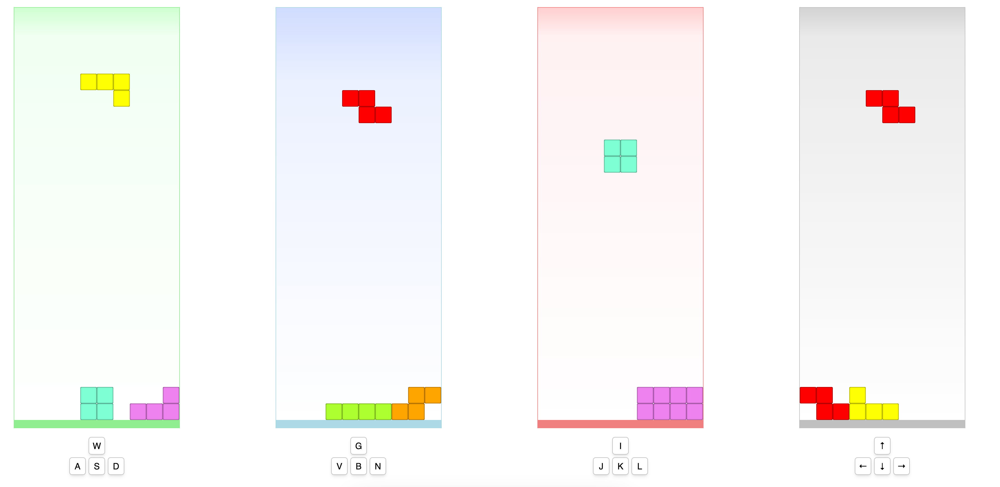
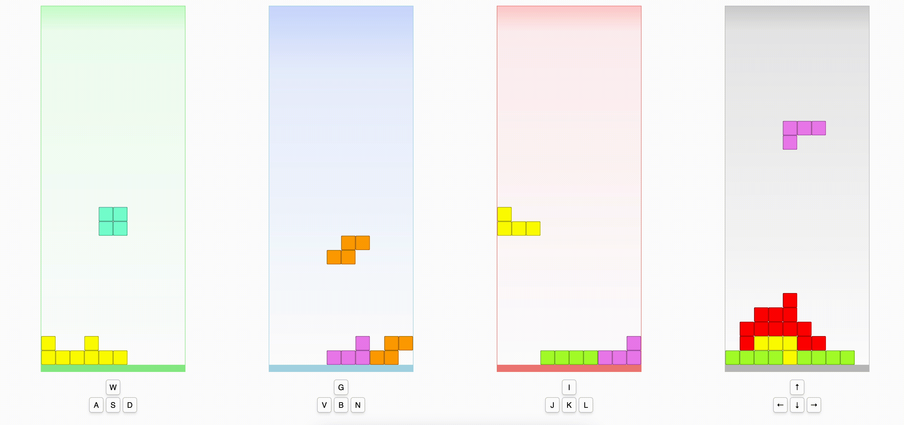
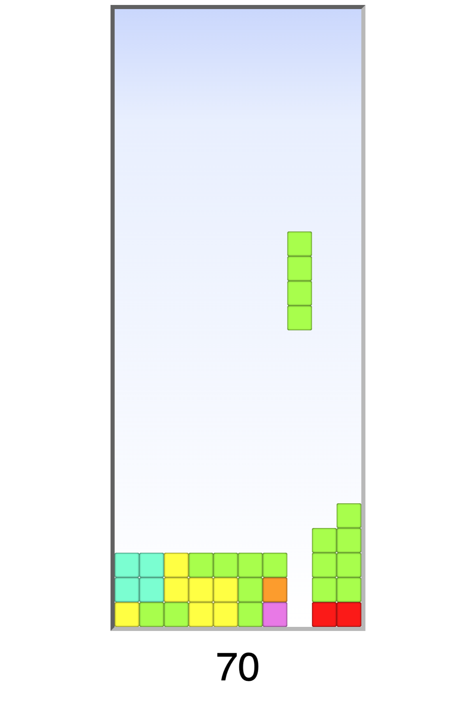
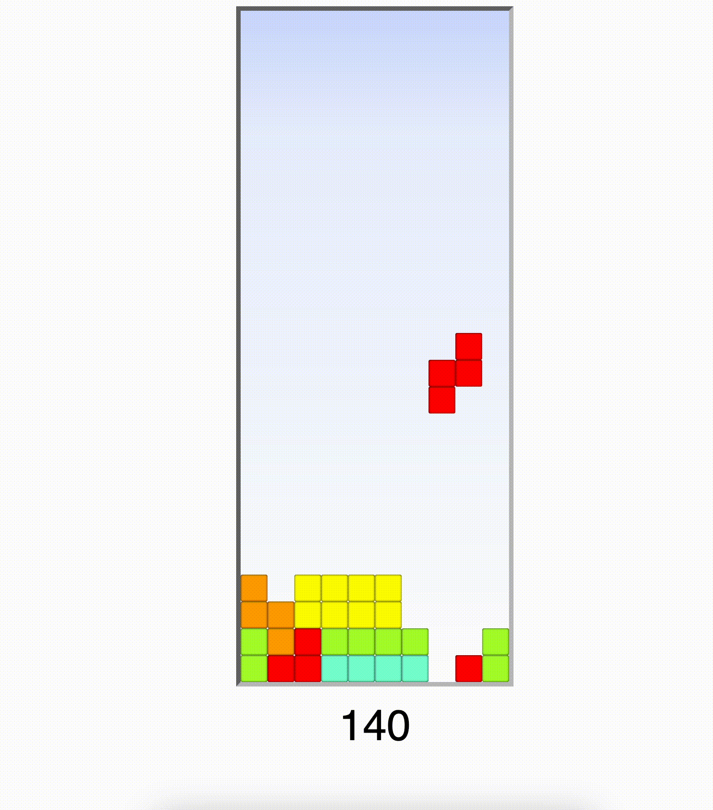
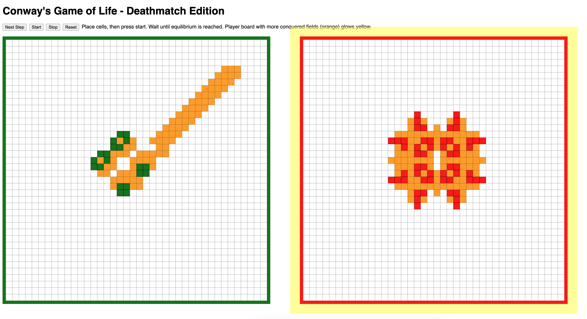
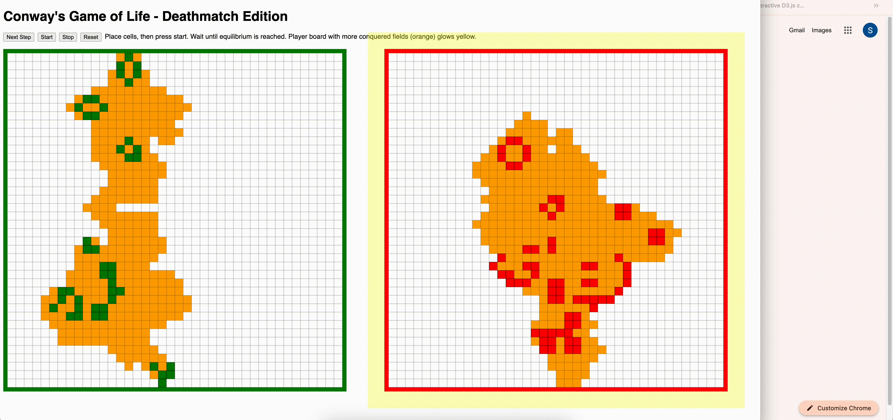
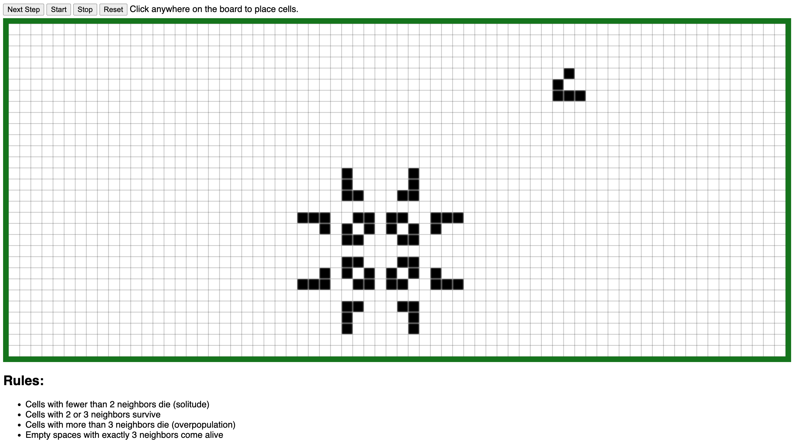
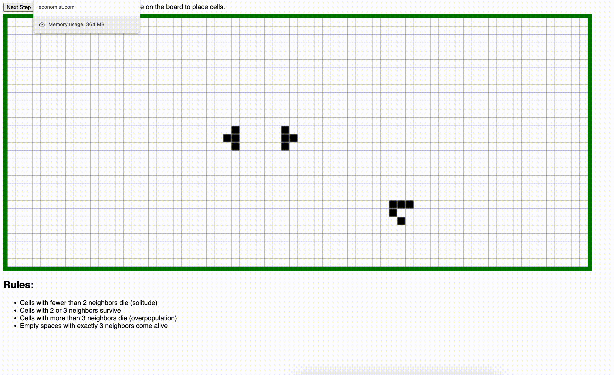

# Pages

## Games
* built using web technologies
* no dependencies
* for educational purposes

### 4 player Webtris

* Play here: https://whobubble.github.io/4p-webtris
* Repo: https://github.com/whobubble/4p-webtris

#### How to Play

* Open index.html in the browser
* Use the keys indicated below the boards to turn, move and drop

### Webtris

* Play here: https://whobubble.github.io/webtris
* Repo: https://github.com/whobubble/webtris

#### How to Play

* Open index.html in the browser
* Use the arrow keys to play
   * Up: Turn right
   * Down: Drop immediately
   * Left: Move left
   * Right: Move right

### Conway's Game of Life - Deathmatch Edition

* Play here: https://whobubble.github.io/conway-deathmatch
* Repo: https://github.com/whobubble/conway-deathmatch

#### How to Play

* Open index.html in the browser
* Place cells, then press start. 
* Wait until equilibrium is reached.
* Player board with more conquered fields (orange) glows yellow.

### Conway's Game of Life

* Play here: https://whobubble.github.io/conway
* Repo: https://github.com/whobubble/conway

